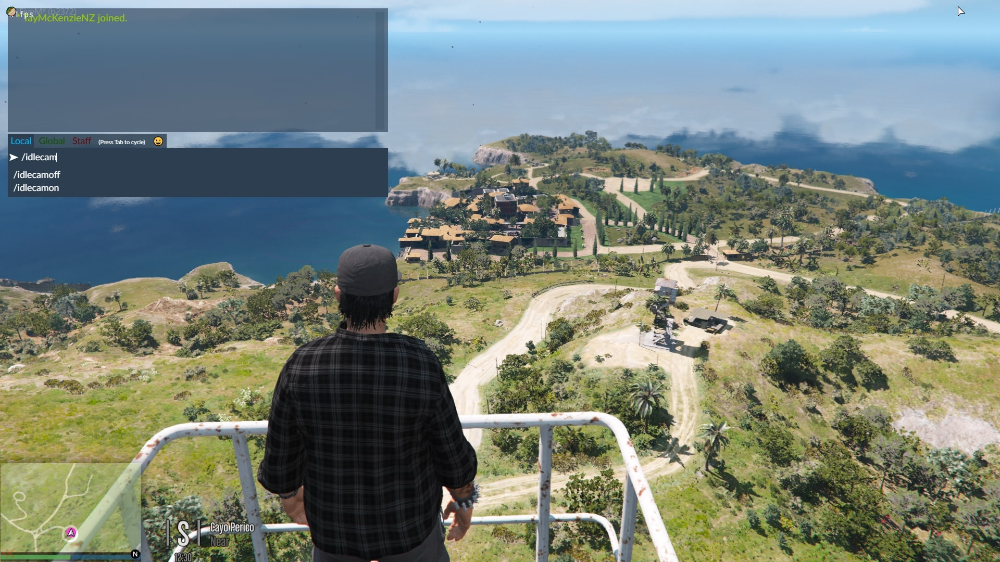
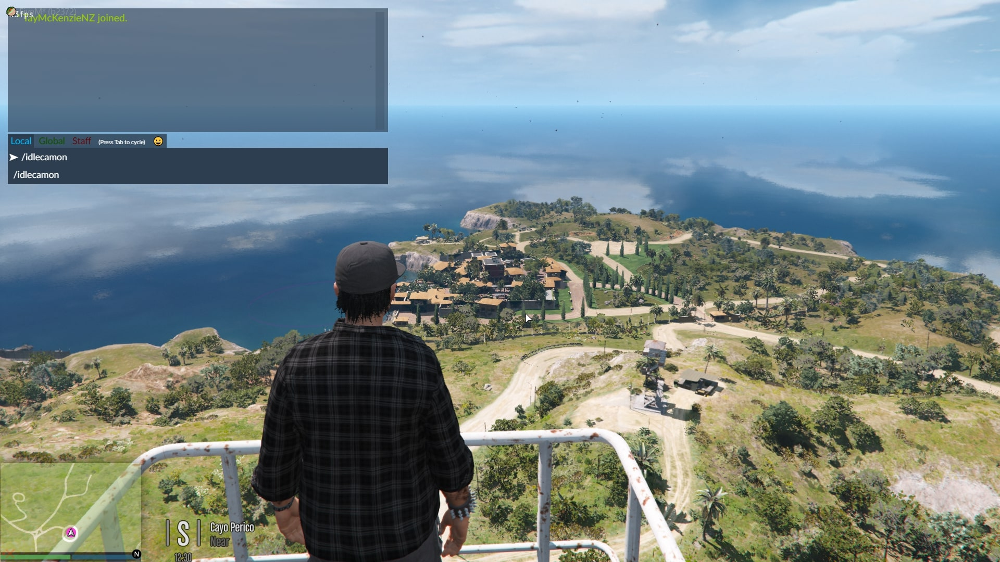
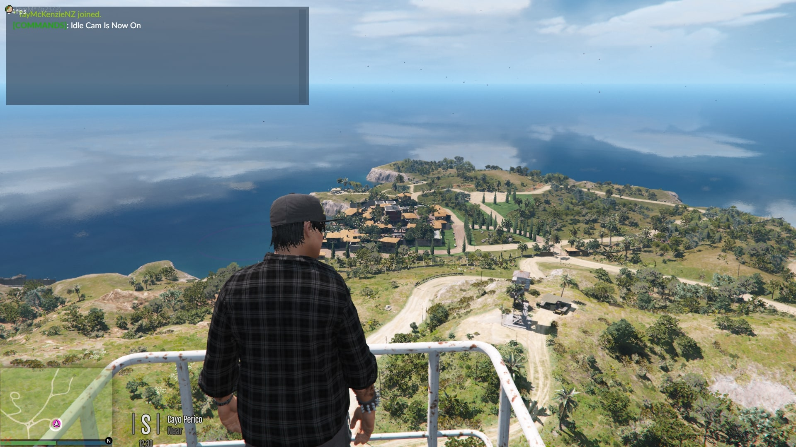
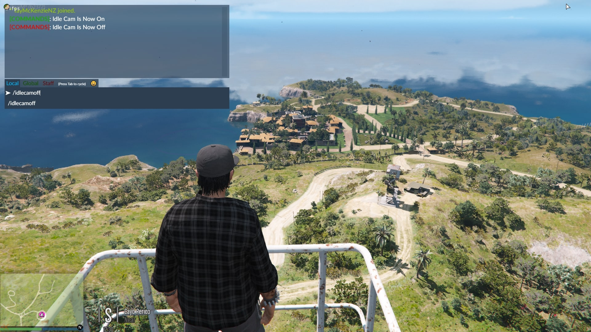

# NoIdleCam

Disable the idle cams for FiveM while on foot or in a vehicle by default.

Useful when watching Twitch or YouTube streams on in game TV screens or possibly during RP scenarios.

Made with [[pmms](https://github.com/kibook/pmms)] in mind 🐩

# Installing:

1. Add to your resources folder or [Scripts] folder

2. Add start NoIdleCam to your server.cfg

# Toggle ON/OFF

In chat type '/idlecamon' to toggle it on, and '/idlecamoff' to turn it back off.

# Enjoy 🥰📺

# Screenshots 

| | | |
|-|-|-|
|  |  |  |
|  |

_**Video Preview:**_

[![NoIdleCam For FiveM] (http://i3.ytimg.com/vi/fbNFSCHI5GI/maxresdefault.jpg) (https://www.youtube.com/watch?v=fbNFSCHI5GI)
